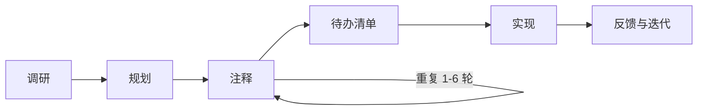
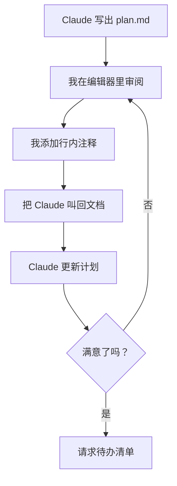
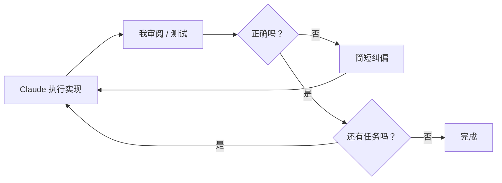
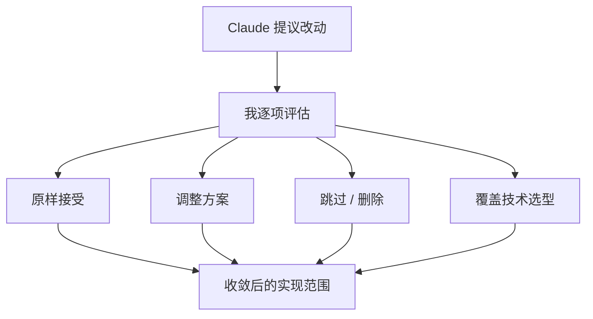

# 我如何使用 Claude Code

<!-- more -->

2026 年 2 月 10 日

## 目录

- [阶段 1：调研](#phase-1-research)
- [阶段 2：规划](#phase-2-planning)
- [注释循环](#the-annotation-cycle)
- [阶段 3：实现](#phase-3-implementation)
- [实现过程中的反馈](#feedback-during-implementation)
- [始终握住方向盘](#staying-in-the-drivers-seat)
- [单次长会话](#single-long-sessions)
- [一句话总结这套工作流](#the-workflow-in-one-sentence)

我把 [Claude Code](https://docs.anthropic.com/en/docs/claude-code) 当作主力开发工具已经大约 9 个月了，而我最终形成的工作流，和大多数人使用 AI 编码工具的方式截然不同。多数开发者是输入一个 prompt（提示词），有时开计划模式，修错，再重复。更“常年泡在技术社区”的那拨人，还会把 ralph loops、MCPs、gas towns（当年流行过的几种编排玩法）之类的东西串起来。两种方式最后都很乱，一碰到稍微复杂的任务就会散架。

我接下来要说的流程只有一个核心原则：**在你审阅并批准书面计划之前，绝不让 Claude 写代码**。把规划和执行分开，是我做过最重要的事。它能防止无效返工，让我继续掌控架构决策，并且相比一上来就写代码，用更少 token 得到明显更好的结果。

## 阶段 1：调研

每个有意义的任务都从“深读”指令开始。我会先让 Claude 彻底理解代码库中相关部分，然后再做任何其他事。并且我总会要求它把结论写进一个可长期保留的 Markdown 文件，而不是只在聊天里口头总结。

> 深入阅读这个文件夹，彻底理解它如何工作、它做什么，以及所有细节。完成后，把你的学习和发现写成一份详细报告，保存到 research.md
>
> 深入研究通知系统，理解其中的复杂细节，并写一份详细的 research.md 文档，把“通知是如何工作的”所有关键信息都记录下来
>
> 梳理任务调度流程，深入理解并查找潜在 bug。这个系统确实有 bug，因为它有时会运行本应被取消的任务。持续研究这条流程，直到把所有 bug 都找出来；在全部找全之前不要停。完成后，把你的发现写成详细的 research.md 报告

注意这些措辞：**“深入”**、**“细节”**、**“复杂性”**、**“把所有东西都过一遍”**。这不是废话。没有这些词，Claude 就会略读。它会看一个文件，只在函数签名层面理解“这个函数做什么”，然后继续往下。你必须明确传达：只看表面是不被接受的。

这份书面产物（`research.md`）非常关键。它不是让 Claude 做作业，而是我的审阅界面。我可以读它、核对 Claude 是否真的理解系统，并在进入规划之前纠正误解。调研错了，计划就会错；计划错了，实现就会错。输入垃圾，输出垃圾。

这是 AI 辅助编码里最昂贵的失败模式，而且不是语法错误，也不是逻辑错误，而是“局部看起来能跑、放进系统就出问题”的实现。比如：某个函数忽略了已有缓存层；某个迁移没考虑 ORM（对象关系映射）的约定；某个 API 端点重复了系统里已有逻辑。调研阶段正是用来避免这些问题的。

## 阶段 2：规划

在我审完调研后，我会要求 Claude 在单独的 markdown 文件里给出一份详细实现计划。

> 我想做一个新功能 <名称和描述>，让系统能够实现 <业务结果>。请写一份详细的 plan.md，说明如何实现，并附上代码片段
>
> 列表接口应从 offset 分页改为基于游标的分页。请写一份详细的 plan.md 说明如何实现。提出改动前先读源文件，计划必须基于真实代码库

生成的计划通常都会包含：实现思路的详细说明、展示实际改动的代码片段、会被修改的文件路径，以及相关考虑和权衡。

我用自己的 `.md` 计划文件，而不是 Claude Code 内置的计划模式。内置计划模式很差。markdown 文件给了我完整控制权：我可以在编辑器里直接改、加行内注释，而且它会作为项目里的真实产物长期存在。

**我经常用的一个技巧：** 对于边界清晰的功能，如果我在开源仓库里见过优秀实现，我会把那段代码和计划请求一起给 Claude。当我想加 sortable IDs（可排序 ID）时，我会贴一个做得好的项目里的 ID 生成代码，然后说：“他们是这样做 sortable IDs 的，请写个 plan.md，解释我们如何采用类似方案。”Claude 在有具体参考实现时，效果会比“从零设计”好很多。

但计划文档本身并不是最有意思的部分。真正关键的是接下来发生的事。

## 注释循环

这是我工作流里最有辨识度、也是我价值最大的一环。

Claude 生成计划后，我会在编辑器里打开它，**直接在文档里加行内注释**。这些注释会纠正它的假设、否掉某些方案、增加约束，或者补上 Claude 没有的领域知识。

注释长度变化很大。有时只有两个词，比如它把某个参数标成可选，我就在旁边写“不可选”。有时是一整段，解释业务约束，或者贴一段代码来说明我期待的数据结构。

我会写的一些真实注释例子：

- _“迁移用 drizzle:generate，不要手写 SQL”_ —— Claude 不知道的领域约束
- _“不对，这里应该是 PATCH，不是 PUT”_ —— 纠正错误假设
- _“这一段整个删掉，这里不需要缓存”_ —— 否决提议方案
- _“队列消费者已经处理了重试，这段重试逻辑是冗余的。删掉，让它直接失败就行”_ —— 解释为什么要改
- _“这里错了，可见性字段应挂在 list 本身，不是单个 item。list 是公开的，所有 item 都公开。请按这个方向重写 schema 部分”_ —— 直接重定向整段计划

然后我会让 Claude 回到文档继续改：

> 我在文档里加了一些注释，请逐条处理并更新文档。先不要实现

**这个循环会重复 1 到 6 次。** 这句明确的 **“先不要实现”** 防护非常关键。没有它，Claude 一旦觉得计划“差不多”就会直接开写代码。只有我说“可以”，它才算真的够好。

### 为什么这招这么有效

这个 markdown 文件在我和 Claude 之间充当了**共享可变状态**。我可以按自己的节奏思考，在“出错的精确位置”写注释，再无损接续上下文。我不是在聊天消息里把一切重讲一遍；我是直接指向文档里的具体位置，把修正写在那个位置。

这和通过聊天消息“遥控实现”是本质不同的。计划文档是结构化、完整、可整体审阅的规格；聊天对话则需要不断滚动回看，才能重建决策脉络。两者相比，计划文档每次都赢。

三轮“我加了注释，请更新计划”，就能把一份通用计划打磨成完全贴合现有系统的方案。Claude 在理解代码、提出方案、写实现上都很强，但它不知道我的产品优先级、用户痛点，以及我愿意接受的工程权衡。注释循环就是我把这些判断力注入进去的方式。

### 待办清单

在实现开始前，我总会要求把任务拆得足够细：

> 给计划补一份详细 todo list，包含完成该计划所需的所有阶段和子任务 - 先不要实现

这会形成一张在实现过程中可追踪进度的清单。Claude 每完成一项就会打勾，所以我在任何时刻扫一眼计划，就知道当前准确进度。对于一跑就是数小时的会话，这点尤其有价值。

## 阶段 3：实现

当计划就绪后，我会下实现指令。这个提示词我打磨成了可跨会话复用的标准模板：

> 全部实现。每完成一个任务或阶段，就在计划文档里标记为已完成。直到所有任务和阶段全部完成前不要停。不要加不必要的注释或 jsdoc，不要使用 any 或 unknown 类型。持续跑 typecheck，确保没有引入新问题。

这一条提示词编码了所有关键要求：

- _“全部实现”_：计划里所有内容都做，不要挑着做
- _“在计划文档中标记完成”_：计划是进度唯一事实来源
- _“所有任务和阶段完成前不要停”_：中途不要停下来要确认
- _“不要加不必要注释或 jsdoc”_：保持代码干净
- _“不要用 any 或 unknown”_：维持严格类型
- _“持续跑 typecheck”_：尽早发现问题，不要最后才收尾

这套措辞（只做少量变体）我几乎每次实现都会用。等我说出“全部实现”时，所有决策其实已经做完并验证过了。实现阶段就该是机械执行，而不是创作。这个设计是刻意的。**我希望实现阶段是“无聊”的。** 真正的创造性工作，已经在注释循环里完成了。计划一旦正确，执行就应该顺滑直行。

如果没有规划阶段，常见情况是：Claude 在早期做了一个“看似合理但其实错误”的假设，接着在这个假设上叠了 15 分钟代码，最后我不得不拆一整串改动。那句“先不要实现”，基本把这种情况彻底消除了。

## 实现过程中的反馈

Claude 开始按计划执行后，我的角色会从架构师切换到监督者。我的提示会明显变短。

原本在规划阶段可能是一整段说明，到实现阶段往往一句话就够：

- _“你漏了 `deduplicateByTitle` 函数。”_
- _“你把设置页做在主应用里了，它应该在管理后台，挪过去。”_

Claude 拥有完整计划上下文和当前会话上下文，所以这种短句纠偏就足够。

前端是最迭代密集的部分。我会在浏览器里测试，然后连续发很短的修正：

- _“再宽一点”_
- _“还是被裁了”_
- _“这里有个 2px 缝”_

遇到视觉问题时，我有时会贴截图。一张表格错位截图，通常比文字描述更快说明问题。

我也会持续引用现有代码：

- _“这个表格要和 users table 一模一样：同款表头、同款分页、同款行高密度。”_

这比从零描述设计精确得多。成熟代码库里的新功能，大多是已有模式的变体。新的设置页就应当长得像已有设置页。指向参考实现，就能传达大量隐含要求，而不用全部展开写出来。Claude 通常会先读这些参考文件，再去修正。

当实现方向走偏时，我不会尝试在错误方向上修补。我会先回滚，再缩小范围，直接丢弃当前 git 改动：

- _“我把东西都回滚了。现在我只想让列表视图更简洁，别做别的。”_

回滚后再收窄范围，几乎总比在坏方案上增量修修补补效果更好。

## 始终握住方向盘

即便我把执行委托给 Claude，**我也从不把“要构建什么”这件事的最终决定权交出去**。绝大多数主动引导都发生在 `plan.md` 文档里。

这很重要，因为 Claude 有时会给出“技术上正确、但对项目来说错误”的方案。比如方案过度设计，或者修改了系统其他部分依赖的公开 API 签名，或者在简单问题上选了更复杂的解法。对于整个系统、产品方向和团队工程文化，我知道的上下文是 Claude 没有的。

**从提案里按项摘取（Cherry-picking）：** 当 Claude 一次识别出多个问题时，我会逐条决策：_“第一个直接用 Promise.all，别搞太复杂；第三个提成独立函数提高可读性；第四和第五先忽略，不值得这点复杂度。”_ 我是在基于当前优先级做逐项判断。

**主动裁剪范围：** 当计划里有“锦上添花”项时，我会主动砍掉。_“把下载功能从计划里删掉，我现在不做这个。”_ 这能防止范围蔓延。

**保护既有接口：** 当我知道某些东西不该变时，会设硬约束：_“这三个函数的签名不要改，适配方应该是调用方，不是库本身。”_

**覆盖技术选型：** 有时我有 Claude 不知道的明确偏好：_“用这个模型，不要用那个”_，或者 _“用这个库内置方法，不要自己造。”_ 这种覆盖要快、要直接。

Claude 负责机械执行，我负责判断取舍。计划先锁定大决策，后续通过选择性引导处理实现中冒出来的小决策。

## 单次长会话

我会把调研、规划、实现放在**同一个长会话**里，而不是拆成多个会话。一个会话可能从深读文件夹开始，经历三轮计划注释，再一路跑到完整实现，整段都在同一条连续对话里完成。

我并没有看到大家常说的“上下文窗口用到 50% 后性能明显下降”。恰恰相反：当我说“全部实现”时，Claude 已经在整个会话里持续构建理解了：调研阶段读文件，注释循环里修正心智模型，吸收我给的领域知识纠偏。

当上下文窗口接近上限时，Claude 的自动压缩上下文（auto-compaction）仍能保留足够信息继续工作。更关键的是，计划文档这个持久化产物会以完整形态保留下来。我随时都可以把 Claude 再指回那份文档。

## 一句话总结这套工作流

先深读，再写计划；把计划注释到完全正确；然后让 Claude 一口气执行到底，中途不停，并一路做类型检查。

就这些。没有魔法提示词，没有复杂系统指令，没有花哨技巧。只有一条纪律化流水线，把“思考”和“敲代码”分开。调研避免 Claude 在无知状态下改动；计划避免它在错误方向上改动；注释循环注入我的判断；实现指令让它在决策定稿后不中断地执行。

试试这套流程。你会怀疑自己以前怎么会在“你和代码之间没有一份可注释计划文档”的情况下，用 coding agents（编码智能体）把东西交付出去。
