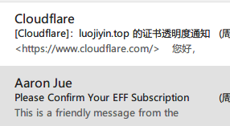
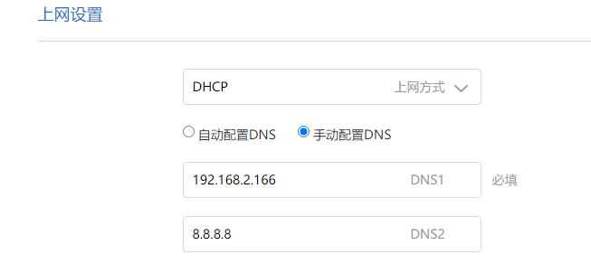
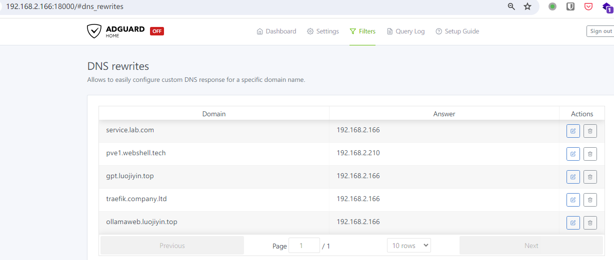
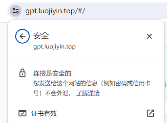

## 使用 Certbot 在内网签发 wildcards（通配符证书）

### 前置条件

1.  Certbot 和 certbot-dns-cloudflare 插件
2.  域名的 NS 服务器设置为 cloudflare， 配置好，大概一天后生效（保守估计）
3.  内网 DNS 服务器， 如果路由器支持定义局域网域名，可以不安装，我用的是 adguard
4.  内网 Ubuntu 服务器  
5.  Ubuntu 安装 Nginx

#### 安装 Certbot

``` bash
sudo apt install -y certbot
```

因为域名的 NS 服务器在 cloudflare， 需要使用 `certbot-dns-cloudflare` 插件

``` shell
sudo apt-get install python3-certbot-dns-cloudflare
```

#### 获取用户 API 令牌

- 登录到 Cloudflare Dashboard 。
- 前往 "My Profile" \> ["API Tokens"](https://dash.cloudflare.com/profile/api-tokens) 。
- 确认你的 API 令牌具有所需的权限（`Zone.Zone:Read` 和 `Zone.DNS:Edit`），并且选择要使用的域名。

在服务器上创建文件 `vim ~/.cloudflare.ini`,写入如下内容

``` ini
dns_cloudflare_api_token =  xxx  ##  对应域名的 api token
```

然后修改文件权限，只可以本用户可读写 `chmod  600 ~/.cloudflare.ini`

#### 签发证书

``` shell
 sudo certbot certonly \                                                       --dns-cloudflare \                                                       --dns-cloudflare-credentials    ~/.cloudflare.ini  -d  \                 'yourdomain.com, *.yourdomain.com'
```

就可以看到如下

``` shell
Saving debug log to /var/log/letsencrypt/letsencrypt.log
Requesting a certificate for yourdomain.com and *.yourdomain.com
Waiting 10 seconds for DNS changes to propagate

Successfully received certificate.
Certificate is saved at: /etc/letsencrypt/live/yourdomain.com/fullchain.pem
Key is saved at:         /etc/letsencrypt/live/yourdomain.com/privkey.pem
This certificate expires on 2024-08-10.

These files will be updated when the certificate renews.

Certbot has set up a scheduled task to automatically renew this certificate in the background.
- - - - - - - - - - - - - - - - - - - - - - - - - - - - - - - - - - - - - - - -
If you like Certbot, please consider supporting our work by:

 * Donating to ISRG / Let's Encrypt:   https://letsencrypt.org/donate

 * Donating to EFF:                    https://eff.org/donate-le

- - - - - - - - - - - - - - - - - - - - - - - - - - - - - - - - - - - - - - - -
```

几分钟后应该收到 cloudflare 和 Certbot 的邮件。

<figure>

<figcaption
aria-hidden="true"></figcaption>
</figure>

因为这个证书是有 90 天的有效期， 需要把 cerbot 加入定时任务。先验证 Cerbot 续签是否可以成功

``` shell
certbot renew --dry-run
```

 Ubuntu 和 Debian 使用了 `systemd` ， 在安装 Certbot 过程中已经设置好了，不需要在自己手动加入 `Crontab` ， 验证状态。
 \`\`\`shell
 systemctl status certbot.timer

● certbot.timer - Run certbot twice daily Loaded: loaded (/lib/systemd/system/certbot.timer; enabled; preset: enabled) Active: active (waiting) since Sun 2024-05-12 22:49:11 CST; 53min ago Trigger: Mon 2024-05-13 01:49:57 CST; 2h 7min left Triggers: ● certbot.service May 12 22:49:11 traefik systemd\[1\]: Started certbot.timer - Run certbot twice daily.

    如果发行版没有使用 `systemd`  ， 运行命令， 编辑定时任务
    ```shell
    crontab -e 

加入如下内容

``` shell
0 0,12 * * *  sudo certbot renew --quiet
```

每天 0 点， 12 点运行一次， `--quiet` 参数确保只有在发生错误时才会有输出。 更详细的日志可以通过下面的命令查看

    less /var/log/letsencrypt/letsencrypt.log

请注意，Certbot 通常会在证书到期前 30 天尝试续签，所以即使你设置了每天检查，实际的续签操作并不会每天发生。

#### 配置 Nginx 读取证书

``` yaml
server {
    listen 443 ssl http2;
    listen [::]:443 ssl http2;
    server_name yourdomain.com www.yourdomain.com;

    ssl_certificate /etc/letsencrypt/live/yourdomain.com/fullchain.pem;
    ssl_certificate_key /etc/letsencrypt/live/yourdomain.com/privkey.pem;

    ssl_protocols TLSv1.2 TLSv1.3;
    ssl_ciphers 'ECDHE-ECDSA-AES128-GCM-SHA256:ECDHE-RSA-AES128-GCM-SHA256:ECDHE-ECDSA-AES256-GCM-SHA384:ECDHE-RSA-AES256-GCM-SHA384:DHE-RSA-AES128-GCM-SHA256:DHE-RSA-AES256-GCM-SHA384';
    ssl_prefer_server_ciphers on;
    ssl_session_cache shared:SSL:10m;
    ssl_session_timeout 10m;
}
```

请将 `yourdomain.com` 替换为你的实际域名。

``` shell
sudo nginx -t
```

验证 Nginx 配置

``` shell
sudo systemctl reload nginx
```

使用新配置。

#### 配置 内网 DNS 服务器

需要在路由器指定 内网 DNS 服务器，我用的是小米路由器


192.168.2.166 我的 dns 服务器的内网IP。

配置内网 DNS 服务器， 我用的是 Adguard

验证 DNS 解析

``` shell
dig gpt.luojiyin.top                                                      ; <<>> DiG 9.18.18-0ubuntu2.1-Ubuntu <<>> gpt.luojiyin.top               ;; global options: +cmd                                                  ;; Got answer:                                                           ;; ->>HEADER<<- opcode: QUERY, status: NOERROR, id: 50327                ;; flags: qr rd ra; QUERY: 1, ANSWER: 1, AUTHORITY: 0, ADDITIONAL: 1     ;; OPT PSEUDOSECTION:                                                    ; EDNS: version: 0, flags:; udp: 65494                                   
;; QUESTION SECTION:                                                     
;gpt.luojiyin.top.              IN      A                                

;; ANSWER SECTION:                                                       
gpt.luojiyin.top.       10      IN      A       192.168.2.166            
;; Query time: 4 msec                                                     
;; SERVER: 127.0.0.53#53(127.0.0.53) (UDP)                                
;; WHEN: Mon May 13 00:13:12 CST 2024
```

然后指定 公网 DNS 服务器 119.29.29.29

``` shell
dig gpt.luojiyin.top @119.29.29.29                                           
; <<>> DiG 9.18.18-0ubuntu2.1-Ubuntu <<>> gpt.luojiyin.top @119.29.29.29      
;; global options: +cmd                                                   

;; Got answer:                                                           

;; ->>HEADER<<- opcode: QUERY, status: NOERROR, id: 48075                 
;; flags: qr rd ra; QUERY: 1, ANSWER: 0, AUTHORITY: 1, ADDITIONAL: 0     
;; QUESTION SECTION:                                                      
;gpt.luojiyin.top.              IN      A                                

;; AUTHORITY SECTION:                                                     

luojiyin.top.           360     IN      SOA     jocelyn.ns.cloudflare.com. dns.cloudflare.com. 2341014133 10000 2400 604800 1800                                                              

;; Query time: 272 msec                                                  

;; SERVER: 8.8.8.8#53(8.8.8.8) (UDP)                                     
;; WHEN: Mon May 13 00:13:32 CST 2024                                     
;; MSG SIZE  rcvd: 99
```

就可以发现 DNS 解析只在内网生效。

然后用浏览器打开你自己的网址，可以看到。


就可以在内网使用 https，可以使用很多高级 web 特性了。

### 总结

考虑大部分人接触过 Nginx，以 Nginx 作为示范。 可以根据自己的情况换成阿里云或者腾讯云，需要设置域名的 NS 服务器设置为对应的云。由于是 wildcard（通配符域名），只需签发一次， `yourdomain.com` `*.yourdomain.com` 等域名可以用。

思路是通过 DNS 验证，Certbot 通过 token 给 CF 的 DNS 服务器添加一个 `TXT` 记录， 然后 Cerbot 读取这个 `TXT` 记录，是否一致，验证你对域名的控制权并签发证书。也是国内很多云服务商为什么让你加一个 `TXT` 记录，才签发一个**单个域名证书 (Single-domain SSL certificate)** ，不舍得给你一个 **通配符证书 (Wildcard SSL certificate)** ，让你反复操作。

一图胜千言

Certbot 就是图中的 Caddy

如果不使用 Nginx， 而使用云原生的网关软件，会变得更自动化，更简单。
