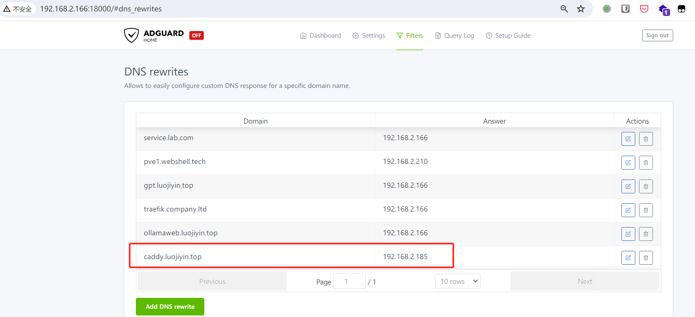
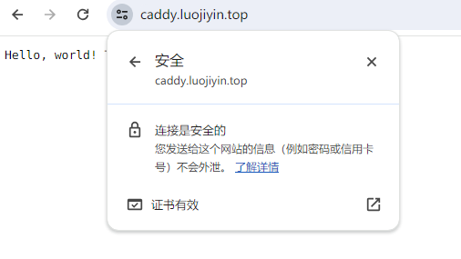

# 使用 Caddy 和 CloudFlare 在内网自动签发 https 证书

## 前置条件

1.  Caddy 和 dns-cloudflare 插件，需要构建自己的 Docker 镜像
2.  域名的 NS 服务器设置为 cloudflare， 配置好，大概一天后生效（保守估计）
3.  内网 DNS 服务器， 如果路由器支持定义局域网域名，可以不安装，我用的是 adguard
4.  内网 Ubuntu 服务器
5.  Ubuntu 安装 Docker

## 构建 Docker 镜像

在 docker compose 同一层 文件夹里，创建一个 Dockerfile

```yaml
FROM  caddy:builder AS builder

RUN caddy-builder \
github.com/caddy-dns/cloudflare

FROM caddy:latest

COPY --from=builder /usr/bin/caddy /usr/bin/caddy
```

在 docker compose 使用 Dockerfile

```yaml
version: "3.7"

services:
    caddy:
        container_name: caddy
        build:
            context: .
            dockerfile: Dockerfile
```

## 获取用户 API 令牌

-   登录到 Cloudflare Dashboard 。
-   前往 "My Profile" > "[API Tokens](https://dash.cloudflare.com/profile/api-tokens)" 。
-   确认你的 API 令牌具有所需的权限（Zone.Zone:Read 和 Zone.DNS:Edit），并且选择要使用的域名。
    在 docker compose 同一层 文件夹里 创建一个 `.env` 文件

```yaml
CLOUDFLARE_API_TOKEN = your token
```

然后修改文件权限，只允许本用户读写。

```shell
chmod  600 .env
```

## 编写 Caddyfile 文件

在 docker compose 同一层 文件夹里，创建一个 Caddyfile 文件

```yaml
caddy.luojiyin.top {
  tls {
       dns cloudflare {env.CLOUDFLARE_API_TOKEN}
  }
  respond / "Hello, world! This is a static response from Caddy." 200
}
```

Caddy 直接输出一个静态页面，验证签发是否成功。

## 完整的 Docker compose 文件

```yaml
version: "3.7"

services:
    caddy:
        container_name: caddy
        build:
            context: .
            dockerfile: Dockerfile
        ports:
            - "80:80" # Remember that Caddy does HTTP to HTTPS redirections automatically.
            - "443:443"
        environment:
            - CADDY_INGRESS_NETWORK=caddy
            # If you don't want to write your token here, remember that Docker Compose picks up
            # variables from an .env file if present in the same directory as the compose file.
            - CLOUDFLARE_API_TOKEN=${CLOUDFLARE_API_TOKEN}
        networks:
            - caddy
        volumes:
            - "/var/run/docker.sock:/var/run/docker.sock"
            # It is important to have these to conserve data after the container restarts
            - "./data:/data"
            # Unless we want to SSH to our server every time it restarts.
            - "./config:/config"
            - "./Caddyfile:/etc/caddy/Caddyfile"
        restart: unless-stopped

networks:
    caddy:
        name: caddy
```

完整的文件夹目录

```shell
├── Caddyfile
├── config                                                               
│   └── caddy  [error opening dir]                                       
├── data
│   └── caddy  [error opening dir]
├── docker-compose.yml
└── Dockerfile
```

启动服务

```shell
docker compose up
```

没加 `-d` , 第一次启动查看日志， 会读取 `Dockerfile` 文件构建镜像，加入 cloudflare 插件， 从 `.env` 文件 获取 `CLOUDFLARE_API_TOKEN` 。

```text
caddy  | {"level":"info","ts":1715595177.3236513,"logger":"tls.obtain","msg":"obtaining certificate","identifier":"caddy.luojiyin.top"}
caddy  | {"level":"info","ts":1715595177.32397,"logger":"tls","msg":"finished cleaning storage units"}
caddy  | {"level":"info","ts":1715595179.2300568,"logger":"tls.issuance.acme","msg":"waiting on internal rate limiter","identifiers":["caddy.luojiyin.top"],"ca":"https://acme-v02.api.letsencrypt.org/directory","account":""}
caddy  | {"level":"info","ts":1715595179.2301404,"logger":"tls.issuance.acme","msg":"done waiting on internal rate limiter","identifiers":["caddy.luojiyin.top"],"ca":"https://acme-v02.api.letsencrypt.org/directory","account":""}
caddy  | {"level":"info","ts":1715595180.2085311,"logger":"tls.issuance.acme.acme_client","msg":"trying to solve challenge","identifier":"caddy.luojiyin.top","challenge_type":"dns-01","ca":"https://acme-v02.api.letsencrypt.org/directory"}
caddy  | {"level":"info","ts":1715595197.6058002,"logger":"tls.issuance.acme.acme_client","msg":"authorization finalized","identifier":"caddy.luojiyin.top","authz_status":"valid"}
caddy  | {"level":"info","ts":1715595197.605848,"logger":"tls.issuance.acme.acme_client","msg":"validations succeeded; finalizing order","order":"https://acme-v02.api.letsencrypt.org/acme/order/1723709497/269014373307"}
caddy  | {"level":"info","ts":1715595199.1746569,"logger":"tls.issuance.acme.acme_client","msg":"successfully downloaded available certificate chains","count":2,"first_url":"https://acme-v02.api.letsencrypt.org/acme/cert/049f29c5f90a9c14bd9acdb84ff4ab90af77"}
caddy  | {"level":"info","ts":1715595199.176429,"logger":"tls.obtain","msg":"certificate obtained successfully","identifier":"caddy.luojiyin.top"}
caddy  | {"level":"info","ts":1715595199.1766984,"logger":"tls.obtain","msg":"releasing lock","identifier":"caddy.luojiyin.top"}
```

没有报错信息， 基本成功了。

## 配置内网 DNS

<figure>

<figcaption
aria-hidden="true">配置内网域名解析</figcaption>
</figure>

打开浏览器验证



## 总结

一图胜千言

是不是比用 Nginx 简单多了。
