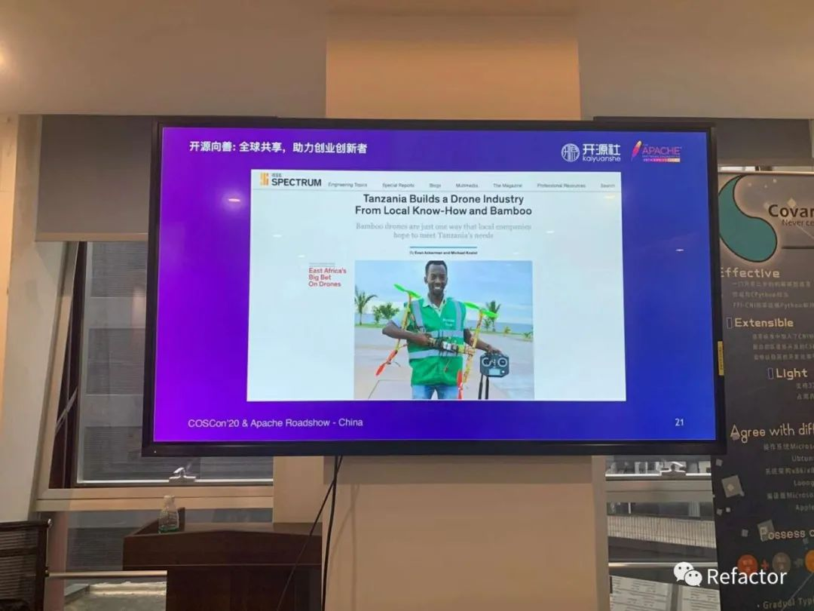

# 星星之火，可以燎原

大家好，我是牛牛，我来自 **成都FCC社区**！

如果你问我为什么要在开篇自我介绍，因为我对FCC以及FCC的每一个人感到骄傲和自豪！

10月24号在这个对计算机行业来说很特殊的日子，*成都FCC社区* 承办了 *2020年开源年会成都分会场*。大会主题是开源向善，开源一词看似是程序员专属，可成都分会场的志愿者大部分却不是计算机专业，有森林保护专业、国际贸易专业、外语专业等。当我问她们为什么会来时，她们答道“看到了，就想来了解一下”。

或许有时就是不经意间听到的某个观点或某句话，就会在自己心中种下了一颗种子，一颗永远不会枯死的种子。

因有幸参加过18、19年两届 *成都FCC社区* 举办的技术大会，所以会不自觉的将本届大会与往届对比，由于今年改成了线上直播模式，所以现场参会观众并不多。说实话差距很大，落差感很大，有些失落难过。

多亏喵喵喵（成都FCC组织者之一）在24号下午组织的闪电演讲让场子“热”了起来，演讲涉及技术、产品、开源、健身等领域。闪电演讲结束后喵喵喵问了一个问题：**“各位觉得什么是开源？”**

现场顿时安静了下来，直到有个人答道：**“白嫖”**，观众们笑了，或许看到这两个字的时候你也会不禁一笑。

但细想一下，**开源**对大部分开发者来说可能就是从 *GitHub clone* 一个项目，或者从 *npm* 引入一个开源库，大家一直在享受着开源带来的便利，但如何通过开源让更多人受益？中国人常说“知恩图报”（或许这个词用在此处不太恰当，但的确想不到更好的词来表述），而“无以为报”不就是白嫖吗？

我们都是开源的受益者，然而在享受开源项目的便利时，如何去“报恩”？论语有云：“或曰：“以德报怨，何如？”子曰：“何以报德？以直报怨，*以德报德*””。而何以报开源？我认为只有 *以开源报开源*，并且 *开源的目的应该是纯粹的*。

### 👨‍💻受益的只有开发者吗

起初我认为只有我们开发者才会受益于开源的便利性（或许很多人和我的想法一样），而闪电演讲过程中 *曾征（PX4布道师）* 的演讲却让我有了更深的认知：非洲一个黑人小孩使用 PX4 和竹子开发了一个属于自己的无人机！

没错，你没有听错使用竹子🎋在非洲这种信息技术不那么发达的地方，一个孩子制作出一个无人机是一个大新闻。开源的传播，也让更多不是开发者的人受益，*GitHub* 第一大开源项目 *freeCodeCamp（即FCC）* 中有很多课程，从前端、算法到 *Python*、深度学习，*FCC* 也让更多普通人了解到了编程，并且其中有很多人由此找到了一份不错的工作。FCC成员与Quincy（FCC项目创始人，是个可爱的大叔）现场视频时也说道，有越来越多的志愿者加入FCC，同时FCC也在推出越来越多的课程帮助想学编程的人。

细细想来，其实当我们在使用手机、电脑时就是在受益于开源项目。

会后大家并未散去，而是在会场搬个板凳开起了 *圆桌会*。

水歌想让 *FCC社区* 的活动和大会更纯粹，所以也在逐渐减少各种大厂的 *加持* 和赞助，希望大家能够更自在的交流沟通自己的项目和社区，所以也在坚持在开源市集，但越来越少的赞助和大厂加持让参会人数越来越少。

“从高中搞社团到现在15年，越来越多的人受益于开源项目，但是国内开源的氛围却没实质性改变”，虽然我了解开源的时间很短，但听到这番话我却觉得很可悲。在场的各位都表达了自己对开源和如何更好的推广传播开源的想法，他们都是偏理想主义者，有些开发者听到他们的想法可能会觉得是在异想天开。鸟贵有翼，人贵有志，也正是因为他们的存在，因为他们的坚持才守住了国内开源的星星之火，他们单纯、可爱、可敬！

这些开源的先驱者可能会怀疑自己的努力与尝试是否是值得的。我认为这是有价值的，努力与尝试在其他人心中埋下了伏笔，或许某一天他们的故事就与埋下的伏笔呼应了！

2018年前端大会水歌在我心中播种了一颗种子，*成都FCC社区* 为其灌溉，种子还在生长，我和 *成都FCC社区* 的故事还在继续🌱

孤阴不长，独阳不生，开源不是靠一己之力就能立即改变整个现状的。*成都FCC* 期待更多人的加入，期待更多人能和我们一起传播开源的种子，让其扎根于大地，生根发芽，待其枝繁叶茂，为更多人“遮风避雨”！
